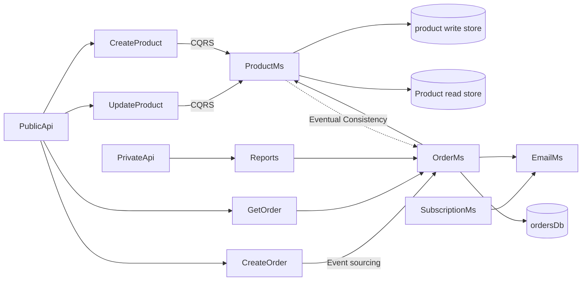

# DiagramaEj

```mermaid
graph LR;
    orderDb[(ordersDb)]
    productWriteDb[(product write store)]
    productReadDb[(Product read store)]
    PublicApi-->CreateProduct;
    PublicApi-->UpdateProduct;
    PublicApi--> CreateOrder;
    PublicApi-->GetOrder;
    UpdateProduct-->|CQRS| ProductMs;
    CreateProduct-->|CQRS| ProductMs;
    SubscriptionMs-->EmailMs;
    CreateOrder-->|Event sourcing|OrderMs;
    GetOrder-->OrderMs;
    OrderMs-->ProductMs;
    OrderMs-->EmailMs;
    PrivateApi-->Reports;
    Reports-->OrderMs;
    ProductMs-.->|Eventual Consistency|OrderMs;
    OrderMs-->orderDb;
    ProductMs-->productWriteDb;
    ProductMs-->productReadDb;
```
